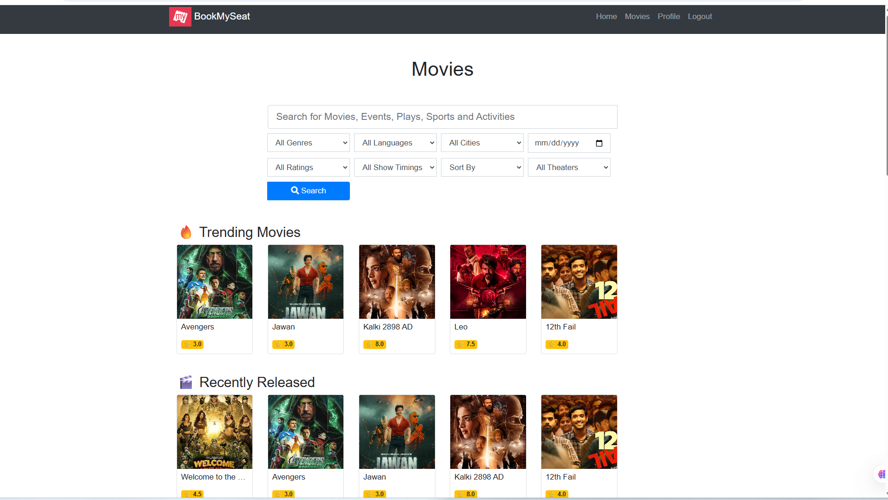
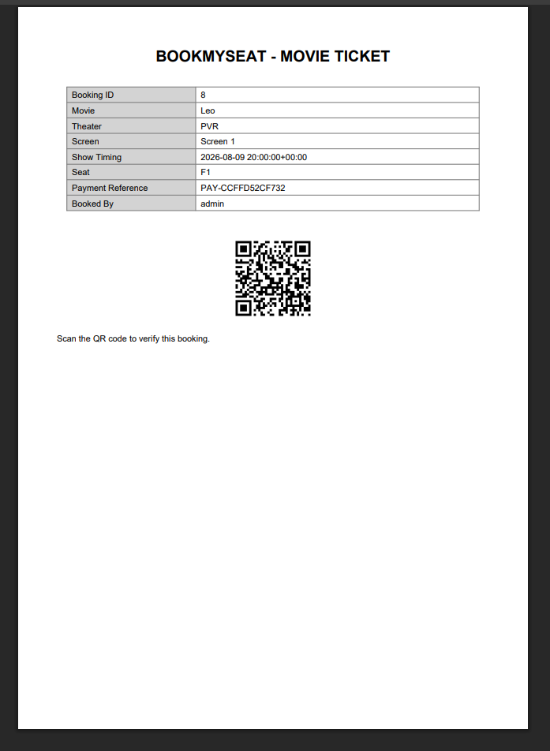
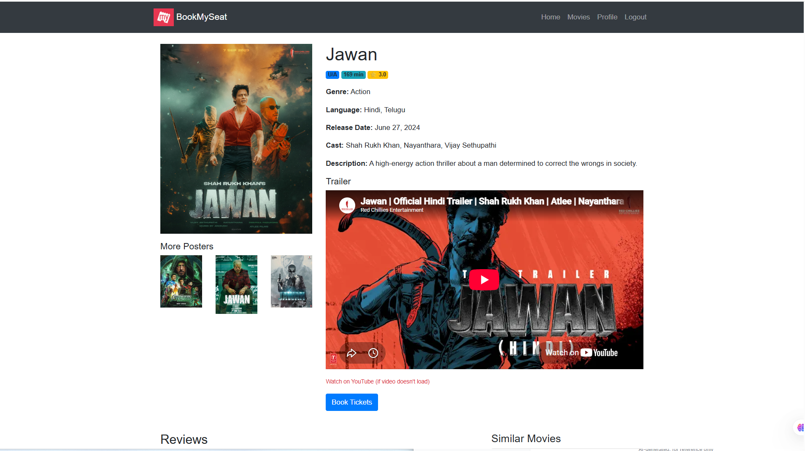
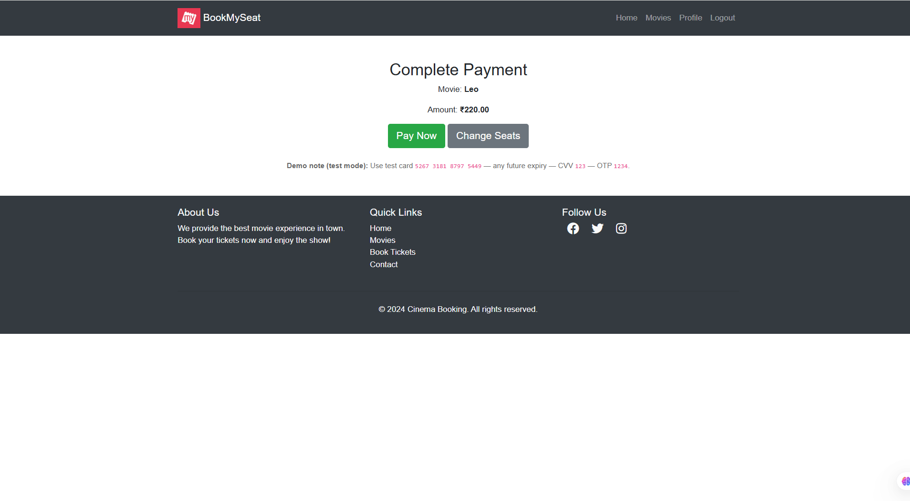
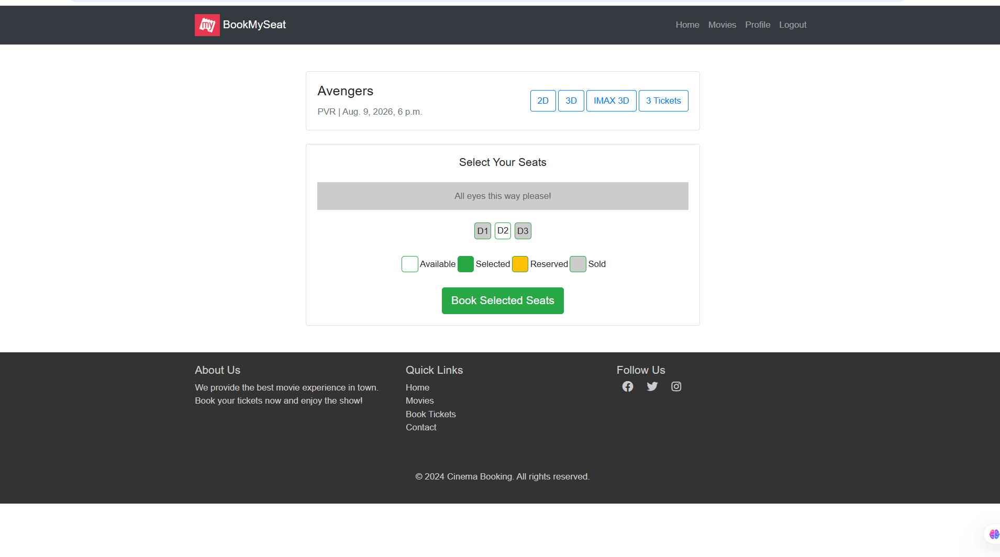
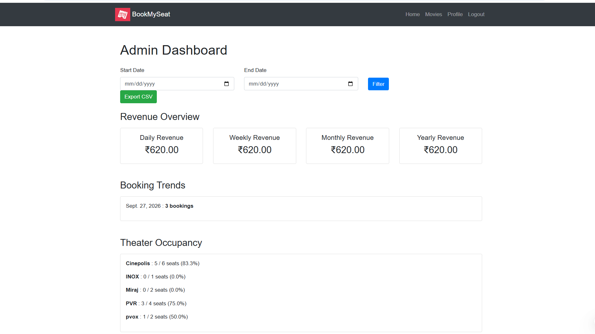
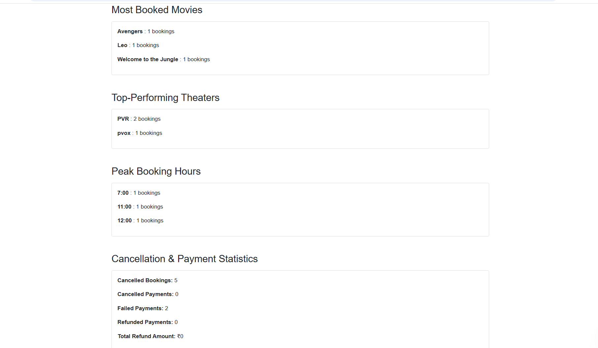

# BookMyShow Django Project

## Project Overview

This is a Django-based online movie booking application developed as part of the Elevance Skills internship program. The project was built by adding the required internship features to the existing Django training project.

## Tasks Completed

### Task 1 – Movie Discovery with Search, Filters and Recommendations
- Movie search by title
- Filtering by genre, language, city, theater, release date, rating and show time
- Sorting by popularity, newest releases, rating and price
- Pagination and dynamic match count
- Trending and recently viewed movies
- "Recommended for You" section

### Task 2 – Automated Ticket Generation and Email Confirmation
- PDF ticket generation
- QR code for verification
- Ticket emailed via Celery background processing
- Automatic retry on failed delivery
- Ticket download from booking history

### Task 3 – Movie Management with Trailer, Reviews and Ratings
- Admin management of movies, genres, languages, cast, theaters and schedules
- Secure YouTube trailer embedding
- Multiple movie posters
- Age certification and duration
- Reviews allowed only after booking and watching
- Automatic average rating calculation
- Review editing and reporting
- Verified viewer badges
- Similar, trending and recently released recommendations

### Task 4 – Complete Payment Workflow with Booking Management
- Razorpay test payment integration
- Server-side payment verification
- Success, failure, cancellation and retry handling
- Webhook verification
- Automatic seat release on failed payments
- Payment transaction records with status and transaction ID
- Complete payment and booking history in profile
- Duplicate payment protection

### Task 5 – Smart Seat Reservation with Live Availability
- Live seat availability
- Multiple seat selection
- 2-minute temporary reservation with automatic expiry
- Duplicate active booking protection under concurrency
- Seat modification before payment
- Clear status indicators (available, reserved, sold)
- Transaction-based booking logic with select_for_update

### Task 6 – Admin Dashboard
- Daily, weekly, monthly and yearly revenue
- Booking trends
- Theater occupancy percentage
- Most booked movies
- Top-performing theaters
- Peak booking hours
- Cancellation and refund statistics
- User growth
- Custom date range filtering
- CSV export
- Optimized Django ORM aggregations
- Database indexes for performance

## Technology Stack

- Python
- Django
- HTML
- CSS
- JavaScript
- PostgreSQL (Neon) — production database
- SQLite — local development
- Razorpay (Test Mode)
- Celery + django_celery_beat
- ReportLab, qrcode, Pillow
- Git and GitHub
- Vercel (hosting)

## Project Structure

```text
bookmyshow-django-project/
├── manage.py
├── bookmyseat/
├── movies/
├── users/
├── templates/
├── media/
├── screenshots/
├── requirements.txt
├── vercel.json
├── release_expired_seats.bat
└── .gitignore

```
## Security
Sensitive configuration such as Django secret keys, Razorpay credentials and email credentials is stored using environment variables and is not included in the public repository.

## Testing
The implemented features were tested during development:

Movie search and filtering

Movie recommendations

Seat reservation and expiry

Duplicate booking protection

Payment workflow (success, failure, cancellation, retry)

Ticket generation and email delivery

Reviews and verified badges

Admin dashboard analytics

CSV export

Performance testing with a large booking dataset

## Internship Details
Program: Elevance Skills Internship

Domain: Full Stack Web Development (Python Django)

Project: BookMyShow Django Project

Developer: Prakruti 

## Future Improvements
Production-grade database and Celery infrastructure

Additional payment providers

Advanced recommendation engine

Enhanced analytics and visualizations

Production monitoring

---

## Project Screenshots

### Task 1 — Movie Discovery with Search, Filters and Recommendations


### Task 2 — Automated Ticket Generation and Email Confirmation


### Task 3 — Movie Management with Trailer, Reviews and Ratings


### Task 4 — Complete Payment Workflow with Booking Management


### Task 5 — Smart Seat Reservation with Live Availability


### Task 6 — Admin Dashboard (Overview)


### Task 6 — Admin Dashboard (Details)
